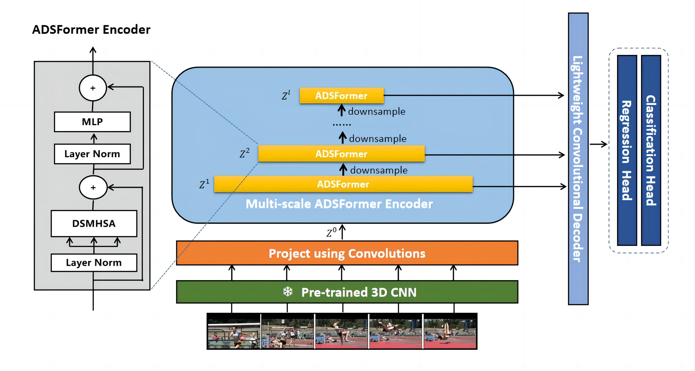
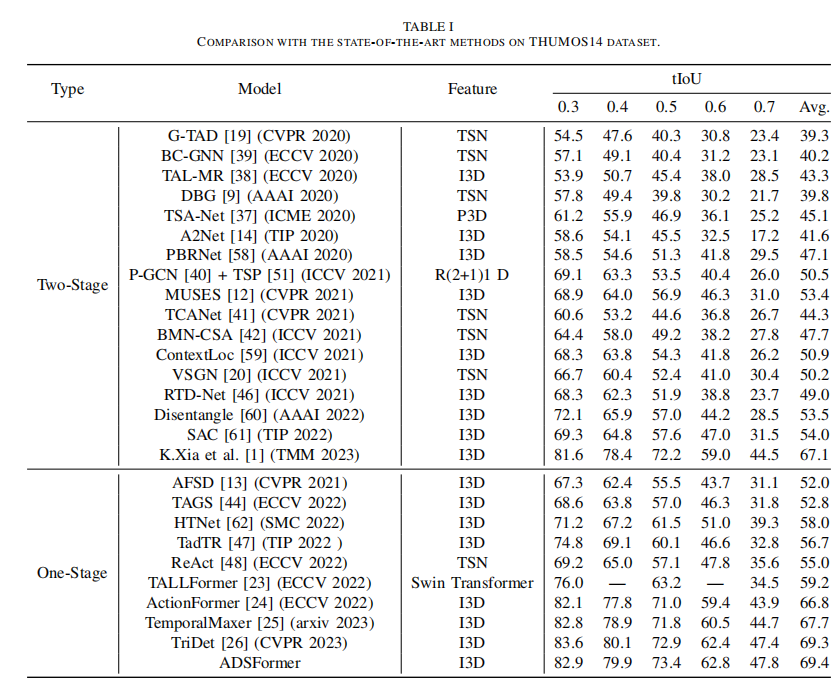
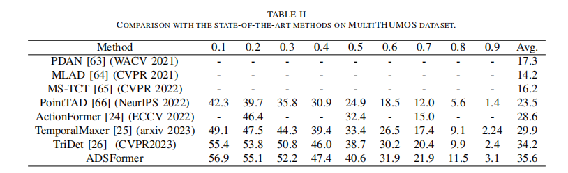
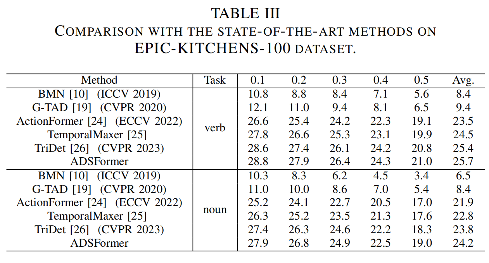
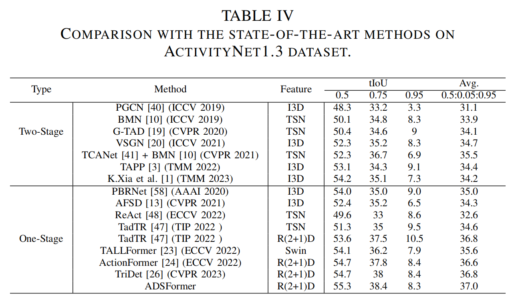

# ADSFormer


An Adaptive Dual Selective Transformer for Temporal Action Localization

Our code is built upon the codebase from [ActionFormer](https://github.com/happyharrycn/actionformer_release),[TemporalMaxer](https://github.com/TuanTNG/TemporalMaxer) and [Tridet](https://github.com/dingfengshi/TriDet), and we would like to express our gratitude for their outstanding work.




## Environment
- Ubuntu20.04
-  NVIDIA RTX A6000 GPU
-  Python3.8, Pytorch2.0 and CUDA11.8
-  `h5py,
joblib,
matplotlib,
numpy,
pandas,
PyYAML,
scikit_learn,
scipy,
setuptools`


## Install NMS
```
cd ./libs/utils
python setup.py install --user
cd ../..
```


## Pretrained Models

We provide our pre-trained models. 

Baidu link：https://pan.baidu.com/s/1BLairYF4rJ-5fEYLWN3zgA?pwd=rnid password：rnid 

Google drive：https://drive.google.com/drive/folders/1giaQytYcsHrVtFkyOJQRbO6mCulJEEVr?usp=sharing

## Training and Evaluation
Train: `python ./train.py ./configs/xxxx.yaml --save_ckpt_dir ./ckpt/xxx`

Eval: `python ./eval.py ./configs/xxxx.yaml <path of the weights>`

## Results








